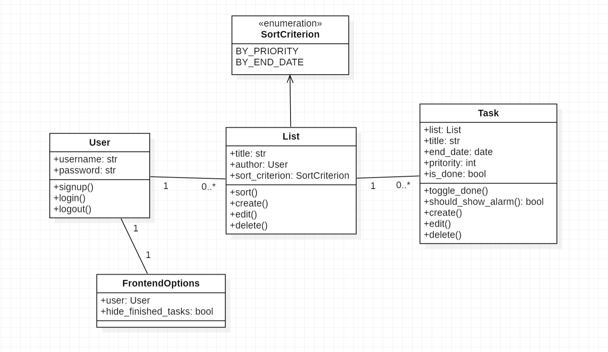
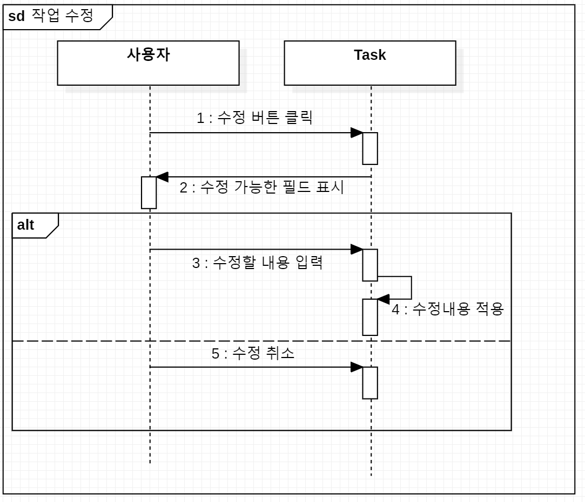

# 설계명세서

## 시스템 설계
본 시스템은 웹을 기반으로 한다.

## 클래스 다이어그램

## 클래스 명세서

### User
사용자의 정보를 담고있는 클래스
- `username`: str: 사용자의 ID
- `password`: str: 암호화된 사용자의 비밀번호

- static `signup()`: `User`
- static `login()`: `User`
- `logout()`: void

### List
할 일들을 담고있는 클래스
- `title`: str: 목록의 이름
- `author`: `User`: 객체를 소유하는 사용자
- `sort_criterion`: enum: 할 일들을 정렬할 기준

- static `create()`: `List`
- `edit()`: void
- `delete()`: void

- `sort()`: 할 일들을 정렬한다.

### Task
각 할 일의 정보를 담고있는 클래스
- `list`: `List`: 이 객체가 속한 목록
- `title`: str: 할 일의 내용
- `end_date`: date: 마감일
- `priority`: int: 우선순위
- `is_done`: bool: 완료여부

- static `create(list)`: `Task`
- `edit()`: void
- `delete()`: void

- `toggle_done()`: void: 완료상태를 변경한다.
- `should_show_alarm()`: bool: 마감일에 기반하여 알람을 띄워야 하는지 불린값 반환.

### FrontendOptions
사용자에게 표시할 내용의 옵션들을 담고있는 클래스
- `user`: `User`: 이 객체가 속한 사용자
- `hide_finished_tasks`: bool: 완료된 할 일들의 가시성이 줄어들어야 하는가?

## 시퀀스 다이어그램
  
수정/추가 예정