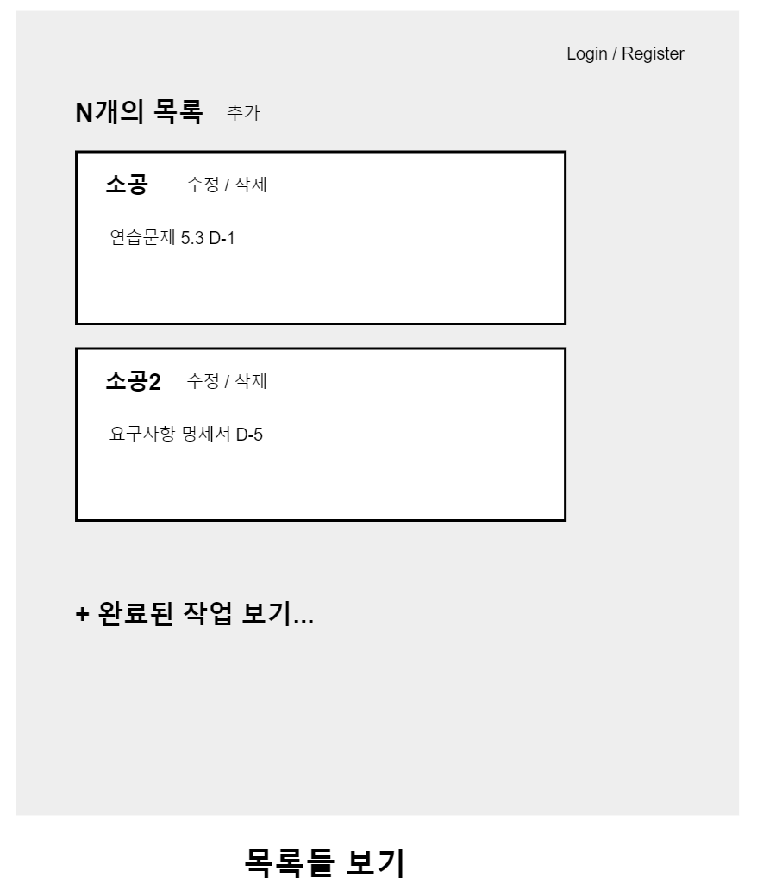
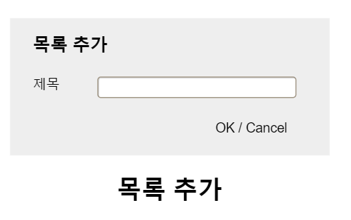
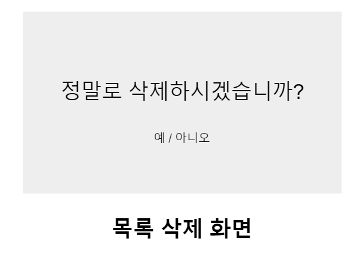
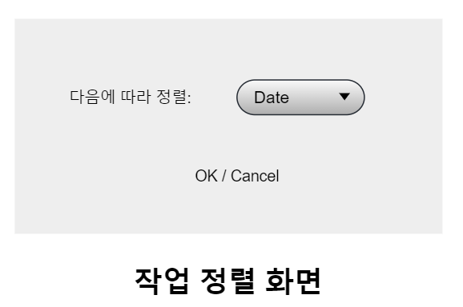
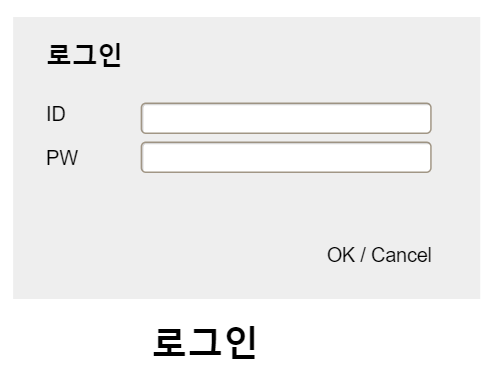

# 3.3. 요구사항 분석: 사용자 인터페이스 요구사항

*계속 수정해나갈 내용*

## 목록들 보기
### 화면

### 요구사항
- 사용자에게 있는 목록들을 나열한다.
- 각 목록을 클릭하면 해당 목록으로 이동해야 한다.
- 목록을 추가하는 버튼이 있어야 한다.

## 목록 추가
### 화면

### 요구사항
- 사용자가 목록의 이름을 지정할 수 있는 필드가 있어야 한다. 시스템은 기본 목록이름을 제공하여 미리 채워놓는다. (예시: 목록2)

## 목록 화면
### 화면

### 요구사항
- 목록의 이름이 보여주어야 하며, 이를 수정하는 버튼이 있어야 한다.
- 해당 목록을 삭제하는 버튼이 있어야 한다.

- 목록 아래에 있는 각 작업들을 나열해야 한다.
- 각 작업을 수정/삭제할 수 있는 버튼이 있어야 한다.
- 새로운 작업을 추가하는 버튼이 있어야 한다.
- 완료된 작업을 보여줄 것인지를 선택하는 버튼이 있어야 한다.
- 작업들을 정렬할 수 있는 버튼이 있어야 한다.

## 목록 삭제 화면
### 화면

### 요구사항
- 시스템은 확인 메세지를 띄워야 한다.

## 작업 정렬 화면
### 화면

### 요구사항
- 시스템은 정렬 기준이 되는 원소를 선택할 수 있는 창을 띄워야 한다.

## 계정등록
### 화면

### 요구사항
- 아이디와 비밀번호, 비밀번호 확인 란이 있어야 한다.

## 로그인
### 화면

### 요구사항
- 아이디와 비밀번호 란이 있어야 한다.

## ...